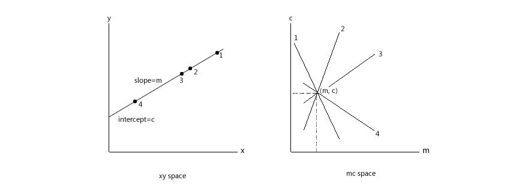
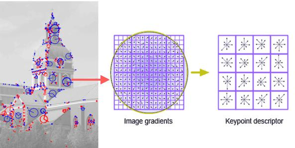
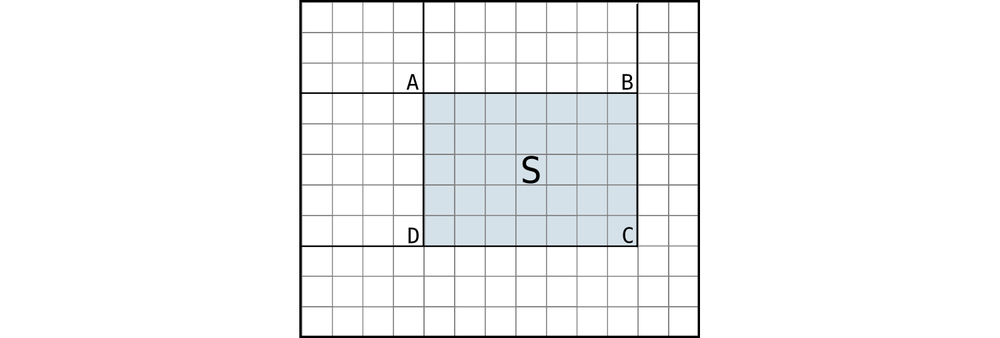
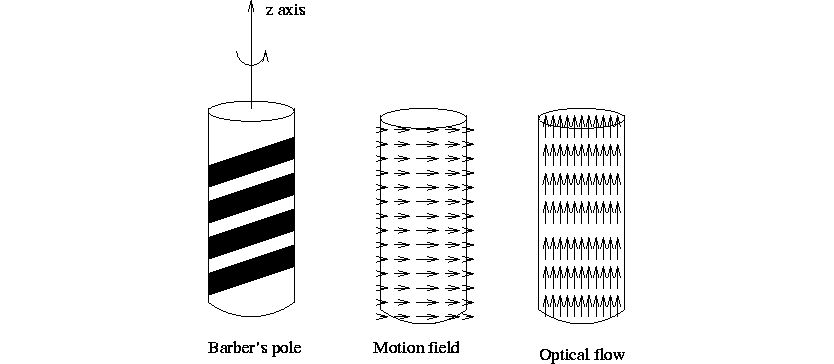
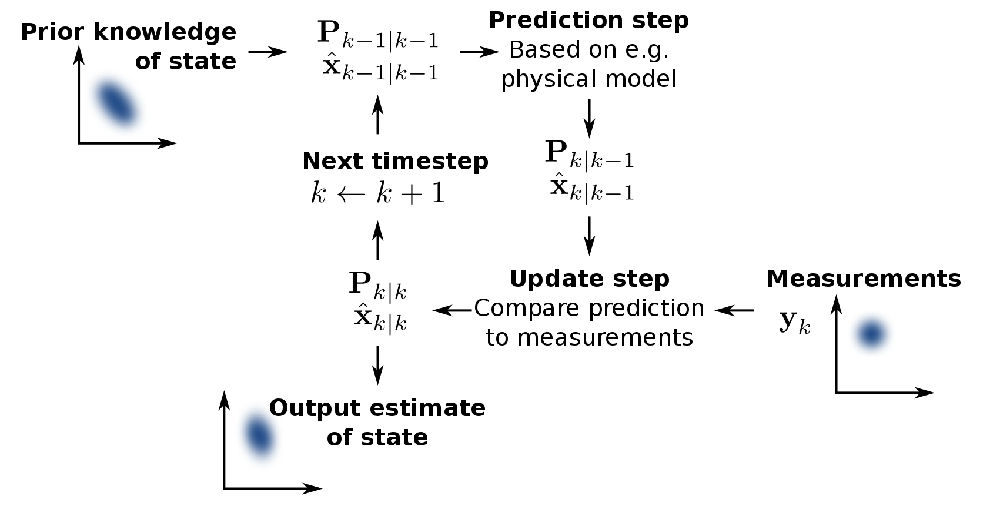
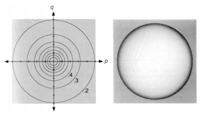

% CS34110: Computer Vision (Exam Notes)
% Charles Newey

# Paradigms in Computer Vision

## Biological Vision

* Physiologically important in the human brain
    * Between 30% and 60% of the human brain involved in visual processing
    * Perceptual illusions and diseased/damaged brains help us study how we process visual data

### Basic Eye Biology

3 layers in eye:

* Sclera (outside part that muscles attach to)
* Choroid (middle layer that contains blood vessels)
* Cornea (circular area in sclera that light enters)

Other relevant parts of the eye:

* Pupil (circular opening in choroid in centre of corna)
* Lens (sits in anterior chamber and bends light rays onto retina)
* Retina (contains nerve cells -- rods and cones)
* Fovea (central area of retina where certain cells are densely packed)
* Rods (sense brightness, evenly distributed across retina)
* Cones (sense colour, densely distributed in fovea)

#### The Two Streams Hypothesis of the Visual Pathway

A massive oversimplification, but quite useful. The theory states that there are two "streams" in
the brain (linked to various cortices):

* Ventral stream: the "what" pathway (object identification and more)
* Dorsal stream: the "where" pathway (spatial relationships, and more)

## Psychological Vision

### Shortcuts

We make lots of assumptions when we "see" things, as can often be shown by optical illusions. For
example:

* Light generally comes from above
* Objects generally have convex borders
* Lines are generally continuous
* Faces are generally upright
* Many more

### Expectation

Our expectations influence what we see. "Change blindness" is a phenomena where a change in a visual
situation that subverts our expectations (for example, a moving cathedral) may go unnoticed. Note
that the change will often become more obvious after it has been noticed originally.

### Gestalt "Pop-Out" Theory

A psychotherapeutic theory of "early vision", suggesting that certain simplistic properties of
images are immediately obvious to the human brain -- for example:

* Proximity -- the human brain is good at spotting spatial clusters of features in an image
* Similarity -- the human brain is good at spotting clusters of similar features in an image, and
  therefore very good at spotting outliers quickly
* Closure -- the human brain is good at "closing" broken lines in an image, which is helpful for
  reconstructing occluded objects
* Many more

Looking at the psychological properties of images can tell us about how brains are constructed. Also
note that Gestalt-style "pop-out" may not work with multiple image properties -- which suggests that
more complex vision (object identification, etc) also involves high-level processing.

## Human Vision Summary

Human vision is inherently:

* Attentive
* Stereo (3D)
* Foveal
* Active (we move around - this helps with occlusion removal and 3D reconstruction)
* Assumptive (we take lots of visual shortcuts)

Computer vision systems are often different to human vision... and not all CV systems are the same.
With that said, studying the psychology and biology of the human visual system can still help us
understand how to optimise visual systems.

## Marr and Nishihara's Theory of Reconstructing Vision

Marr was the first person to develop a complete theory of computer vision. Marr's theory revolved
around reconstruction -- that a large part of vision involves guessing the 3D structure of the
world, and from the resultant model a high-level description (semantics) can be inferred. However,
it's unrealistic (and computationally impractical).

Five stages:

1. Image -- Get light information from everywhere in an FOV. Single frame, colour info irrelevant/
2. Raw primal sketch -- Structure in the world leads to changes in images. Locations in images of
  changes in intensity.
3. Full primal sketch -- Locations from raw primal sketch are grouped into contours and boundaries.
  This is done over several scales.
4. 2.5D sketch -- Going from images to surfaces (guessing shape). Also guessing local depth
   information (e.g., *x* in front of *y*, etc.) and surface orientation (surface normal).
5. 3D model -- A high-level 3D description of the world using generalised cylinders or cones.

## Quantitative vs. Qualitative Vision

Quantities are sensitive to noise and difficult to evaluate in a CV system. (e.g. distances to
objects, etc.). Qualities (relationships between objects) are more stable in noise and easier to
characterise. Why? All sensors are crap. It is difficult (computationally and physically) to extract
exact information... but that's not necessarily important.

### Qualitative Spatial Relations

Developed by Randall, Cui and Cohn in 1992, region connection calculus (RCC) is a qualitative way of
describing spatial relationships.

DC: Disconnected, EC: Externally connected, EQ: Equal, PO: Partially overlapping, TPP: Tangential
proper part, TPPi: Inverse of TPP, NTPP: Non-tangential proper part, NTTPi: Inverse of TPP.

# Vision Systems and Evaluation

## Processing

Stages of computer vision:

* Image processing (e.g. noise reduction, colour calibration, etc.)
* Intermediate representation (e.g. feature extraction, etc.)
* High-level vision (e.g. object detection, tracking, etc.)
* Maybe even more abstract stuff (e.g. semantics -- as in the MIT object detector and Google Images)

There are many steps in a computer vision process -- so how do we build larger systems and verify
that they work?

## Analysing Performance

How can we be sure that our algorithm works? Computer vision scientists take a data-driven approach
to testing algorithms -- separating training and test datasets, using techniques such as n-fold
cross-validation, and by using shared, open (public) datasets.

## Vision Through Learning

Modern computer vision is largely data-driven -- measuring predictions or classifications against
some measure of "ground truth". The way that most computer vision algorithms are analysed is using
large, publicly-available datasets. Some popular datasets include:

* Object recognition -- Caltech 101 (easy -- obsolete), Pascal VOC
* Segmentation -- Berkeley, Daimler
* Face recognition -- Labelled Faces in the Wild (LFW)
* Surveillance -- PETS

### Measuring Success

Useful measures include:

* True positive rate (TPR)
* False positive rate (FPR)
* Confusion matrices
* Mean squared error (distance measure over a set of points)
* Bounding box union or bounding box overlap
* ROC/AUC

#### Confusion Matrices

               Classified True Classified False
---            ---             ---
Actually True  TP              FN
Actually False FP              TN

Also note that confusion matrices can be used for multi-class classification.

#### ROC and AUC

ROC (Receiver Operating Characteristic) curves are a great way to visualise performance of a binary
classifier system because they let us see the system's performance *as a whole*, rather than just
the best part. They plot the FPR (1 - TNR, or specificity) on the *x* axis, and TPR (sensitivity) on
the *y* axis.

A few things to note on the above diagram:

* The dashed red line going diagonally across is the "chance line". If a classifier's curve lies
  mostly on the lower-right side of this line, it's actually *less likely* to predict correctly than
  a coin flip.
* The shaded blue area is the Area Under Curve (AUC). AUC is a measure sometimes used in place of
  ROC because it can be reduced to a single number and gives an objective measure of the algorithm's
  *overall* performance.

#### Bounding Box Union and Overlap

$$
Union = \frac{area(A \cap B)}{area(A \cup B)}
$$

$$
Overlap = \frac{area(A \cap B)}{min(area(A), area(B))}
$$

# Image Formation

## Geometry

### A Simple Pinhole Camera

* Uses perspective projection
* Objects are projected upside-down on the image plane
* You can't recover/calculate the distance between the camera and the object from one viewpoint

$p$ = an arbitrary point; $o$ = the origin; $f$ = focal length

### Real Cameras

Cameras are awful. They have complex control systems, limited depth of field, lens distortions
(complex optics), and various other things that cause trouble (shutter speeds, light sensitivity,
frequency response ranges, etc.).

#### Other Camera Types

* Omni-directional cameras -- either a rotating flat mirror, or a fixed hyperbolic
    * Hyperbolic mirrors distort... lots
    * Non-homogeneous resolution
    * Lots of maths to untangle the image into something same
* Parallel projection
    * Images projected the right way up (instead of upside-down)
    * Imagine a pinhole camera with an infinite focal length

## Radiosity

Brightness depends on: the amount of light hitting a surface (source intensity), the amount of light
that leaves the surface (related to absorption rate), relative positions of light source and camera,
and the orientation of the surface.

There are two different types of reflection: Lambertian and specular. On Lambertian surfaces, the
brightness only depends on the angle between the light source and the surface. Specular reflection
(e.g. a "highlight" on a reflective surface) depends on the location of the viewer.

## Digitisation

Images are not continuous -- pixels only have a limited range of values, and images have a limited
resolution. Obviously data is lost when images are captured.

### Colour Spaces

* HSV (Hue, Saturation, Value)
    * Hue represents colour (0 - 360)
    * Saturation is the quantity of colour (0 - 255)
    * Value is the dark/light scale (0 - 255)
    * Better than RGB but still not great
* CIE L\*a\*b\*
    * L: lightness, a: colour dimension, b: opponent dimension
    * A bit more complicated (based on non-linearly compressed CIE XYZ colour space)
    * But the best separation of luminance and colour

### Calibration

We need to know what the *real* colour is, to correct for colour effects of an optical device. We do
this by looking at the colour of something we definitely know. Cameras can also be calibrated for
lens distortion with "chessboard"-type images. The parallel lines and constrasting squares make it
easy to discern straight lines.

## Edges

### Detection

Images of the world are perceived as *regions* surrounded by *boundaries*. The *boundaries* are made
up of *edges* at the pixel level. However, edges aren't always evidence for boundaries -- they can
be due to lighting changes or other phenomena.

#### Edges as Intensity Changes

Differentiate the intensity profile of an image and look for very high or low values.
Differentiation of digital functions is easy_...
$$ f(x) = x_{0}, x_{1}, x_{2}, x_{3} ..., x_{n} $$
$$ \frac{df}{dx} \approx \frac{x_{2} - x_{0}}{2}, \frac{x_{3} - x_{1}}{2}, ... , \frac{x_{n - 2} - x_{n}}{2} $$

You can also achieve the same result by "dragging" a differential mask (or kernel) over an image.
For example, a $[-1, 0, 1]$ mask dragged across an image will differentiate in one direction. This
is called *convolution*.

#### The Sobel Edge Detector

The edge signal is usually noisy -- a $3x3$ kernel will have a local averaging effect. The Sobel
edge detector (developed in 1968) has this effect, and is still commonly used.

$$
\begin{bmatrix}
    -1 & 0 & 1 \\
    -2 & 0 & 2 \\
    -1 & 0 & 1 \\
\end{bmatrix}
$$

##### Tricks

Combination of *horizontal* and *vertical* edge responses:
$$ S(x) = \sqrt{S_{h}(x)^2 + S_{v}(x)^2} $$
where $S_{h}(x)$ are horizontal edges and $S_{v}(x)$ are vertical edges.

Edge direction computation:
$$ \theta(x) = tan^{-1}(S_{h}(x) / S_{v}(x)) $$
*Note*: This computation is also useful in many other algorithms that involve edge direction.

##### Problems

* Edge thickening (for example, a 1px edge will be doubled)
* Choice of threshold (at what point is a maxima an edge?)

#### Zero-Crossing

Zero-crossing edge detectors use the second derivative of the intensity gradient -- they are good
edge detectors but amplify noise badly because they square any error ($\frac{d^{2}x}{dx^{2}}$).

As with Sobel, we can combine the *horizontal* and *vertical* edge responses using the well-known
"Laplacian". Zero-crossings of the Laplacian correspond strongly to edges.
$$ \Delta^{2}\mathcal{I}(x,y) = \frac{\partial^{2}\mathcal{I}(x,y)}{dx^{2}} + \frac{\partial^{2}\mathcal{I}(x,y)}{dy^{2}} $$

#### Gaussian

Gaussians are used for lots of things in computer vision: (sort-of) noise removal, extraction of
detail at various scales, and more. Gaussian blur of *x* and *y* is given by: $$ G(x, y) =
\frac{1}{2\pi\sigma^{2}}\mathrm{e}^{-\frac{x^{2} + y^{2}}{2\sigma^{2}}} $$ where $\sigma$ is the
*standard deviation* (essentially, the *blur radius*). However, as the data are digital, the blur is
commonly implemented as a digital Gaussian kernel.

##### Second-Order Edge Detection

1. Choose a small value for $\sigma$
2. Blur the image with a Gaussian
3. Filter with Laplacian -- zeroes are edges
4. Increase $\sigma$ and go again -- to locate coarser edges
5. Repeat and accumulate a "pyramid" of edge detections at different scales

This roughly describes the LoG (Laplacian of Gaussians) edge detector. This is sometimes
approximated with a DoG (Difference of Gaussians).

#### The Canny Edge Detector

Developed in 1986, probably still the most widely-used edge detector. Several parameters -- size of
Gaussian filter and two thresholding parameters -- how likely the detector is to *find* an edge, and
how likely it is to *follow* it.

Key points:

* First-order derivative
* Iterated Gaussian blur at different scales
* Directional first derivative
* Non-maximal suppression (to suppress edge thickening)
* Tracking (*hysterisis*) to link weak evidence to strong evidence

### Edge Grouping (Edges to Contours)

How to group detected edges into higher-level features (lines, circles, geometric shapes, or other
models that we may have)?

#### Line Fitting

Generally because of noise, affine transformations in the image plane, and other things, edges are
noisy and don't necessarily reflect reality -- so we have to use some kind of fitting model to group
edge pixels into higher-level features.

##### Least Squares

Least squares (regression) fitting can help us by minimizing the sum of the squared error between
our feature pixel group and our line model ($y = mx + c$), thus giving the line of best fit.

##### Hough Transform

<!-- https://www.youtube.com/watch?v=uDB2qGqnQ1g -->

Useful for detecting any parametric curves (lines, curves, ellipses, circles, etc.). Very robust,
and copes well with broken edges and noise. Given a set of edge points, the Hough transform will try
to find the line equation that best explains the data.

Given a point $(x, y)$, all lines that pass through it can be described by $y = mx + c$. We can
rewrite that so that $c = -xm + y$ -- which is a line in the parameter space of *m* and *c*. So...

Given a set of points in $(x, y)$ space, we can draw all possible lines that pass through each point
in *parameter space* -- $(m, c)$ space. The intersection of these lines in $(m, c)$ space gives us the
*best* line that describes the set of points.

The algorithm works like this:

* An "accumulator array" is initialised $(A(m, c))$ to zero
* For each edge element $(x, y)$, increment *all cells* in the accumulator array that satisfy
  $c = -xm + y$
* Local maxima (peaks) in $A(m, c)$ correspond to fitted lines

However, the Cartesian representation of lines in Hough presents a problem with *perfectly vertical
lines* -- the gradient ($m$) will tend to infinity and cause the algorithm to fail. We can get
around this by using *polar coordinates* instead of *Cartesian coordinates*.

A polar coordinate is represented as $\rho = x\sin{(\theta)} + y\sin{(\theta)}$. When a line in
Hough is transformed from Cartesian to polar coordinate space, it becomes a sinusoidal curve -- but
it is important to note that the principle of intersecting lines in $(m, c)$ space defining the
best-fitting line in $(x, y)$ space remains the same.

##### RANSAC (RAndom SAmple Consensus)

RANSAC is a simple line-fitting algorithm based in probability theory. The idea is that outliers in
a dataset (e.g. noise and other stuff) pull the fitted line away from where it should be -- the
*inliers*.

The algorithm works like this (on a simple level):

* Repeat many times:
    * Fit a model to a random subset of the points (samples)
    * Build a consensus set: other points that fit the model
    * Evaluate quality of the model: size or total error of the consensus set
* Rebuild model with best "consensus set"
* Number of iterations can be estimated based on sample size, probability of outliers, error
  threshold, and other factors

# Features

A good feature is...^[From Tuytelaars and Mikolajczyk, 2007]

* Repeatable (we can find it again)
* Distinctive (it is distinctive enough from the rest of the image)
* Local (it is small enough -- smaller than the image, for example)
* Easy to find (there are enough of them for matching)
* Accurate (it can pinpoint an object of interest with precision)
* Efficient (it can be computed quickly)

## Harris Corners (and KLT)

Corners make great features. An an edge is a place where there's a change in intensity, and a corner
is a place where edges meet. Corners are usually pretty distinct (and so is their neighbourhood),
and they're usually fairly quick to find.

Harris corner features don't just use the corners -- they also use features from the neighbourhood
of the corner (a corner's neighbourhood will be relatively unique). Harris corners uses an "energy
function", which has maxima where $(x, y)$ are values that cause the corner's neighbourhood to be
most different.
$$
E(u, v) = \sum_{x, y}{w(x,y)[I(x + u, y + v) - I(x, y)]^{2}}
$$ <!-- this is to stop markdown parser freaking out -_ -->
where $(u, v)$ describes a neighbourhood around a point $(x, y)$, where $w(x,y)$ is a window
function (returns a 1 if a pixel is in the window, else 0 -- basically an "ignore everything outside
of the window" function), where $I(x + u, y + v)$ is the intensity at pixel $(x, y)$, and where
$I(x, y)$ is the intensity in the original pixel.

An improved version of this algorithm has been worked on and improved  by a number of others,
including Kanade, Lucas and Tomasi (and Shi). The algorithm names vary from "LK", to "KLT", to
"KLTS", but they mean the same thing.

## SIFT (Scale Invariant Feature Transform)

SIFT is a great feature detection algorithm -- it finds features in such a way that they:

* are invariant to scale
* are invariant to rotation (in the image plane -- the $z$ direction)
* are invariant to small translations and rotations in depth
* contain a local description of the image

SIFT (and various others based on it -- e.g. SURF) are considered to be state-of-the-art.

Key points:

* Gaussian pyramid (difference of Gaussians)
* Difference between successive Gaussians gives the DoG
* Extreme of the DoG in space and scale give the scale-invariant features

Features are selected if they have good enough contrast, and they're on a corner (a peak of the
DoG). It's also possible to do sub-pixel localisation of corners by fitting a quadratic model to the
DoG.

A 36-bin orientation histogram is created for each feature to represent Gaussian-weighted feature
orientations. Features are created for each "major orientation" (peaks on the histogram) with their
corresponding orientation.

## SURF ("Speeded Up Robust Features")

SURF is an algorithm extremely similar to SIFT -- the only major differences being a number of
performance optimisations. Amongst other things, it uses box features instead of Laplacian of
Gaussian filters.

# Appearance and Patch-Based Methods

Finding an object in an image is difficult. This can be done with geometric features (e.g. corners,
as described above), but another way is using the appearance of image patches as features.

The process is similar(ish) to convolution (dragging a mask over an image) -- a "patch" is dragged
over the image and compared to the image underneath, looking for matches. Several measures can be
made which describe matches -- the correlation coefficient, the Euclidean distance, or something
else called "mutual information".

## Notation and Constraints

* $\mathcal{I}$: image
* $\mathcal{A}$: image patch ("appearance")
* $\mathcal{A} < \mathcal{I}$

## Euclidean Distance

Sum of squared differences, like so:
$$ d(x, y) = \sqrt{\sum_{i}\sum_{j}[\mathcal{I}(x + i, y + j) - \mathcal{A}(i, j)]^{2}} $$

## Correlation Coefficient

<!-- https://www.youtube.com/watch?v=YjTod0R7cNE -->

Correlation coefficient is better than Euclidean distance in some ways -- correlation is independent
of overall brightness of images.  However, it's also slower than Euclidean distance. There are
several types of correlation coefficient: Pearson's (fast to calculate, but assumes linearity),
Spearman's (assumes a *monotonic* relationship, rather than simply linear), and Kendall's -- which
simply compares concordance between pairs of data points without assuming structure.

# Object Detection

Object *detection* and object *recognition* (while similar), are distinct problems. Detection
involves finding a class of objects in an image (that is, including *in-class* variation in a
model), while recognition involves finding a particular subclass of a class, or a particular
instance (that is, including *between-class* variation in a model). Essentially, it's the difference
between "there is a face in this photo", and "that's Harrison Ford".

## General Framework for Object Detection

* Look at lots of examples of an object class
* Extract some sort of features and represent them some way
* Take the image that you're trying to find the object in
* Represent that image in the same way as your model
* Try to find similarity between your image and your model

## Worked Example: The Viola-Jones Face Detector

* Training data: 5,000 images of faces (positive examples) and 300,000,000 non-faces (negative
  examples)
* Features:
    * Haar features (essentially rectangles of light and dark areas in a certain arrangement)
    * Haar features are weak by themselves, so multiple Haar features are *boosted* (combined in a
      *cascade*) to build up the model
* Speedups: The Viola-Jones face detector uses an *integral image* to calculate the sums of
  rectangles very quickly (each pixel contains the sum of all pixels above and to the left).

The sum of the rectangle $ABCD$ in the integral image above is: $D - B - C + A$ ($A$ is added again because
it gets subtracted twice).

# Object Recognition

## Homography

If you look for close feature matches in a very similar geometric combination, you end up with
object detection that uses *homography*.

Essentially, a homography is a geometric relation describing the transformation of chosen points
between two viewpoints. A homography uses a number of assumptions (for example, that the points lie
on a planar surface -- which is not the case, for example, with faces -- which have sticky-outy
things like noses and suchlike) to establish a model of the geometric relationship between the two
images. This means that, while a homography can deal with *small transformations* in the image plane
quite well, it generally doesn't work so well for *out-of-plane transformations*.

In simpler language: the same scene viewed from two different pesspectives results in two *image
planes*, and the transformation to turn one image plane into another is called a *homography*.

A nice side-effect of using homography is that it will give you *approximate* (and I mean *really*
approximate) surface orientation of the features.

## Modelling In-Class Variation

Homography is quite good for recognising *individual instances* of objects... but less good for
detecting variation within an object class (i.e. sub-classes), and less good at coping with
out-of-plane transformations.

### Bag of Words

A popular framework for object recognition is the "Bag of Words" model.

* Features are detected on a *large* training dataset
* These features are clustered into *visual words*
* An unordered set of *visual words* is created for each object class (this is the "bag")

Key points:

* Needs a large training set of labelled objects
* *"Visual words"* are formed from clusters of features
* Doesn't include information about spatial relationships between *visual words*

## Honourable Mention

* Deformable part-based models (essentially bag-of-words with some structure but with deformable
  "springs" between *visual words* -- e.g., used for pedestrian detection)
* 3D models (e.g. used for gait analysis or pose estimation)

# Motion

Often in computer vision, things of interest to us tend to move. How do we find moving things? Two
main ways: background subtraction and optical flow. Once moving things have been found, it's easy to
group the pixels together into contiguous blobs of *stuff*.

## Background Subtraction

Deciding which pixels to track (or which pixels are interesting) involves deciding what is
*background*, and what is *foreground*. We can use background subtraction for this, and there are
several methods...

### Simple Background Subtraction

Dead easy, dead fast. There are some downsides, though:

* Makes assumptions, too:
    * Scene is (mostly) still
    * Lighting doesn't change much (no flicker or rapid changes in illumination)

The calculation is simple:
$$||I_{n} - I_{0}|| < t \implies \mathrm{background}$$
$$||I_{n} - I_{0}|| >= t \implies \mathrm{foreground}$$
where $t$ is an arbitrary threshold, where $I_{0}$ is a starting image, and $I_{n}$ is a subsequent
image in a video feed. The threshold is used because sensors are noisy and won't always give a
consistent reading.

### Moving Average Background Subtraction

Lighting conditions and stuff that's in the background may change over time, so an adaptive
background is obviously needed. The simplest form of this is a moving average. This form of
background subtraction uses two parameters: $t$ (the threshold), and $w$ (the window size).

The calculations are quite straightforward:
$$||I_{n} - B_{n - 1}|| < t \implies \mathrm{background}$$
$$||I_{n} - B_{n - 1}|| >= t \implies \mathrm{foreground}$$
where
$$B_{n - 1} = \frac{1}{w} \sum^{n - 1}_{j = (n - w)} I_{j}$$
<!-- this is to stop the markdown parser freaking out -_ -->
where
$w$ is the window size (number of frames to average), and $B$ is the average of the last
$(n - 1) - w$ frames.

### Mixture of Gaussians (GMM/MoG)

The background subtraction methods described above are very simplistic. They don't deal with flicker
well (actually, they don't deal with flicker *at all*), and they will still fail given particular
noise patterns. More to the point, the mathematics above assumes a single colour channel (e.g.
grayscale or similar) -- whereas in the real world, a 3D colour space will probably be used (e.g. a
pixel will be a point in RGB space).

Another problem is that variation is not constant, and even the moving average background
subtraction doesn't cope well with noise. We can get around this by modelling noise as a Gaussian
(as noise often obeys a normal distribution). In 2D, a Gaussian is defined by a mean and a standard
deviation -- so instead of a constant threshold ($t$ above), we choose our threshold to be the width
of the Gaussian (so pixels with a *lot* of noise have a high background threshold).

But how to deal with flicker? That's hard. Dealing with Gaussians on one pixel is easy, but dealing
with Gaussians on many pixels is... not so much. We have to use machine learning for this, and the
most common technique is Expectation Maximisation.

The result of combining these things is MoG background subtraction, which is great:

* Deals with complex backgrounds
* VERY robust to noise
* Handles shadows well (can even detect them with an extra layer of classification)

## Optical Flow

*Motion field*: projection of motion of objects onto the image plane.

*Optical flow*: apparent motion of brightness patterns in an image.

Optical flow is only an *approximation* of the motion field. There are two major problems:

* *Apparent motion*. A perfectly homogeneous rotating sphere seems static, but a static homogeneous
  sphere with a moving light source will actually seem to rotate.
* The *aperture problem*. Imagine a barber's pole. Optical flow will show vertical movement (the red
  bars appear to move vertically), but the actual motion of the pole is a lateral rotation around
  the $z$ axis. (Weirdly, this is also a problem for the human brain - our neurons only respond to
  motion in a limited field).

### Dense Optical Flow

The general idea of determining dense optical flow is tracking the movement of image patches around
each pixel in an image. For example, in a video sequence, points in the image will be tracked from
frame to frame -- their new position will be calculated based upon nearby pixels with similar
brightness. It is from this that the direction of travel will become apparent.

This, however, involves some assumptions:

* Rigidity: there is only one motion
* Or smoothness: there are no discontinuities in motion

### Sparse Optical Flow

Sparse optical flow is sort-of similar, but with carefully-chosen features (or keypoints), like SIFT
or SURF. We find features that are easy to find again... and then find them again. This is faster
and more robust dense optical flow. Also known as "feature tracking".

There is still a problem with this approach -- tracks can (and will) get lost (for example, if a
keypoint leaves the frame). There needs to be some logic to decide when to drop keypoints, and when
to reinitialise them when they come back.

## Tracking and Modelling Motion

With video, we'll often want to look at things happening across multiple frames. If you try to run a
detector on every single frame... you'll probably have a bad time, because it likely isn't fast
enough. More to the point, detections are probably also both noisy and computationally expensive.

### Tracking

A general tracking framework:

* Model: We have a prior idea about how something will change
* Predict: Use this to make a prediction
* Measure: Measure what actually happened
* Update: Update the model

Tracking is useful because it smoothes the data -- the estimate of an object's next location is
based on *both* prediction and measurement. It's also useful because it helps give constraints to a
visual search -- you can start looking for the target in the immediate neighbourhood of the
prediction.

### Difficulties with Tracking

* Initialisation (sparse? dense? which features?)
* Tracking multiple targets is difficult
* Losing targets due to fast motion or occlusion (trackers can drift off target and targets can be
  lost)
* Losing target due to appearance change (e.g. large change in orientation)

### Kalman Filter

Kalman filters are great for smoothing any series of data. It might be a series of $(x, y)$
locations, sizes, colours, or anything else. A Kalman filter copes with jitter, noise, and missing
information quite well.

### Mean Shift

Another simple tracking idea -- place a window around the object that we want to track, and then
iterate over the following steps:

* Compute the mean of the data within the window
* Calculate the mean for each window in the image
* Return the window where the mean matches the target window

This doesn't work well in practice. It's sensitive to noise, the window is liable to drift, and it
just generally isn't very robust.

#### CAMShift

CAMShift (Continually Adaptive Meanshift) is an improvement upon meanshift that can adapt the size
of the window over time and uses a threshold for the mean.

# Shape

Sometimes we are interested in recovering the 3D structure of objects and scenes -- for lots of
reasons (e.g. "what's the surface of Mars like?", or digital preservation of historic monuments).

## 2D to 3D is Hard

Method                  Requirements
---                     ---
Shape from shading      1 image, 1 viewpoint, 1 light source
Photometric stereo      2+ images, 2+ light sources
Shape from texture      1+ image(s), lots of assumptions
Shape from motion       2+ images, moving object(s)
Stereo vision           2+ images, 2+ viewpoints
Depth cameras           2+ images, 1 light source, 1 viewpoint

## Shape from Shading

The brightness of a given point in a scene depends on:

* Location and orientation of light source(s)
* Viewer location
* Local orientation of surface
* Properties of the surface

Shape from shading has multiple uses, including creating texture maps of the Moon's surface (or
Mars, in the case of the late Prof. Dave Barnes!). Essentially, by making certain assumptions about
a surface (and its illumination), we can infer 3D structure.

### BRDF

A BRDF (bidirectional reflectance distribution function) calculates the fraction of incident light
reflected in the direction of the viewer.

* $i$: incident angle
* $e$: emittance angle
* $g$: phase angle

BRDF is largely a property of the *surface*; it defines how that surface interacts with light. It
depends on the wavelength of the light and the properties of the object. In computer vision, it's
often determined by taking lots of photos of a surface under precise lighting conditions.

* Lambertian: $\phi(i, e, g) = \cos(i)$
* Specular: $\phi(i, e, g) = 1$ when $i = e$ and $g = i + e$

### Surface Orientation

The orientation of a surface can be described by a surface normal -- a vector that is perpendicular
to both vectors on the planar part of an object's surface.

We can describe normal vectors with two quantities:

* The change in $Z$ as $X$ changes (called $p$)
* The change in $Z$ as $Y$ changes (called $q$)

#### Gradient Space

Gradient space is useful because parallel planes map into a single point and a planes that are
perpendicular to the viewing direction map to a point at the origin. Moving away from the origin
essentially correspond to tilting and slanting the surface.

$$p = \frac{\partial{z}}{\partial{x}}, q = \frac{\partial{z}}{\partial{y}}$$

### Reflectance Maps

Usually displayed as iso-contours (lines on object along which light intensity is constant).

### Extracting Shape from Shading

Given a reflectance map, a single image intensity gives us *a set* of possible orientations. Global
solution is found by integration in gradient and image space. It is assumed that the object is
smooth -- that the surface is uniform in texture and shape. The process involves lots of maths which
aren't necessary to know.

### Photometric Stereo

If we use a single image (and a single light source), we have to make a huge assumption
(smoothness). We can reduce this if we have multiple images, perhaps under multiple lighting
conditions. For this to work, the scene cannot move -- but that way, correspondence between points
in different images is easy.

#### Stereo Calibration

If we have a sphere with roughly the same reflectance as our target object, it can be photographed
under several lighting conditions. We can then use this information to further help us infer
information about our target object.

#### In a Nutshell

* Illuminate the calibration sphere with one source at a time
* Each illumination produces a different image of the sphere, so we have $N$ calibration images
  ($I_{1}, ... , I_{n}$)
* Each surface point with orientation $(p, q)$ produce its own grey level $G(I_{n})$ <!-- -_ -->
* From this set of grey levels, generate a lookup table for gradient space, such that:
  $[G(I_{1}), ..., G(I_{n})] \implies (p ,q)$

## Shape from Texture

Look for repeating patterns on an object's surface (e.g. dimples on a golf ball), or parallel lines.
These patterns then become textures. The way that these textures deform as the surface of the object
changes can then be used to approximate the shape of the object's surface.

Terminology:

* Isotropic: rotation perpendicular to the texture plane doesn't change the texture's appearance
* Homogeneous: the texture appears the same, no matter the orientation
* Texel: an atomic element of a texture -- repeating this creates a texture

There are many methods to detect and/or estimate the structure of texels -- among the most common
are statistical methods for doing this (e.g. Markov Random Field, etc.).

In the case of isotropic textures, a plane's $(p, q)$ gradients can be recovered by measuring the
distortion of texels -- for example, circles may be projected as ellipses on a slanted surface.
Assuming that these texels are indeed circular gives us the ability to work backwards and determine
the slant and tilt of the surface from the *major axes* of the projected ellipses.

In the case of homogeneous textures, the shape is determined from the gradient of the texture
elements. For example, in the instance of a surface with a dotted texture, a change in dot density
indicates a change in orientation.

Both of these methods can be applied locally (as well as globally to a notional plane), but all of
these methods assume some degree of homogeneity in the texture -- which may not be the case.

## Shape from Motion

For example, doing live 3D tracking on a live human, or gait analysis. Ullman (1979) did work on
shape from long-range motion. Two large assumptions are made (parallel projection and rigidity,
although a small amount of deformation is allowed). The initial shape is assumed to be flat,
therefore giving initial distances between points, and then on each subsequent frame, the distances
between points are updated so as to minimise their change. Shape can be derived from this.

## Shape from Occlusions

Contours can be discovered due to discontinuities in depth of an object -- which often correspond to
silhouettes. Full of assumptions...

* Each point on the contour corresponds to a single point on the object
* Nearby points on contours correspond to nearby points on the object
* Points on the contour correspond to planar points on the object

Silhouette from a viewpoint results in a generalised cone containing the object -- the object is the
intersection of several generalised cones. Examining from different viewpoints and iteratively
removing background is commonly known as *space carving*.

## Shape from Focal Length

Most lenses usually have a variable focus and a limited depth of field. By choosing a lens with a
narrow depth of field, the "blurriness" of certain parts of the image can be calculated. By doing
this, we can work out which parts of the image are in focus, and therefore, roughly how far away
they are.
