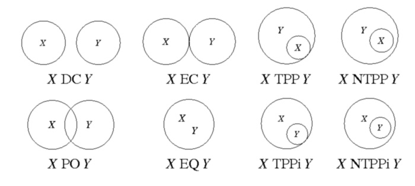
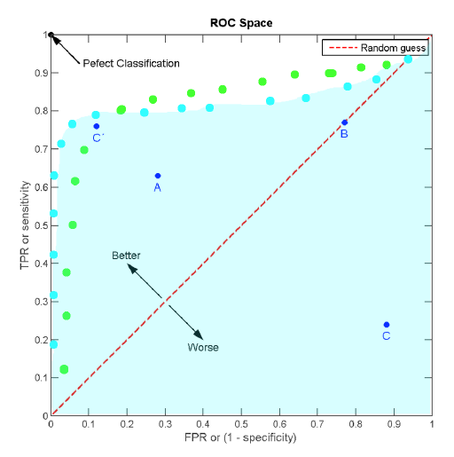
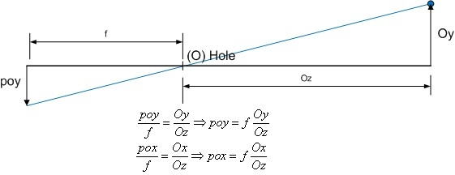

% CS34110: Computer Vision (Exam Notes)
% Charles Newey

# Paradigms in Computer Vision

## Biological Vision

* Physiologically important in the human brain
    * Between 30% and 60% of the human brain involved in visual processing
    * Perceptual illusions and diseased/damaged brains help us study how we process visual data

### Basic Eye Biology

3 layers in eye:

* Sclera (outside part that muscles attach to)
* Choroid (middle layer that contains blood vessels)
* Cornea (circular area in sclera that light enters)

Other relevant parts of the eye:

* Pupil (circular opening in choroid in centre of corna)
* Lens (sits in anterior chamber and bends light rays onto retina)
* Retina (contains nerve cells -- rods and cones)
* Fovea (central area of retina where certain cells are densely packed)
* Rods (sense brightness, evenly distributed across retina)
* Cones (sense colour, densely distributed in fovea)

#### The Two Streams Hypothesis of the Visual Pathway

A massive oversimplification, but quite useful. The theory states that there are two "streams" in
the brain (linked to various cortices):

* Ventral stream: the "what" pathway (object identification and more)
* Dorsal stream: the "where" pathway (spatial relationships, and more)

## Psychological vision

### Shortcuts

We make lots of assumptions when we "see" things, as can often be shown by optical illusions. For
example:

* Light generally comes from above
* Objects generally have convex borders
* Lines are generally continuous
* Faces are generally upright
* Many more

### Expectation

Our expectations influence what we see. "Change blindness" is a phenomena where a change in a visual
situation that subverts our expectations (for example, a moving cathedral) may go unnoticed. Note
that the change will often become more obvious after it has been noticed originally.

### Gestalt "Pop-Out" Theory

A psychotherapeutic theory of "early vision", suggesting that certain simplistic properties of
images are immediately obvious to the human brain -- for example:

* Proximity -- the human brain is good at spotting spatial clusters of features in an image
* Similarity -- the human brain is good at spotting clusters of similar features in an image, and
  therefore very good at spotting outliers quickly
* Closure -- the human brain is good at "closing" broken lines in an image, which is helpful for
  reconstructing occluded objects
* Many more

Looking at the psychological properties of images can tell us about how brains are constructed. Also
note that Gestalt-style "pop-out" may not work with multiple image properties -- which suggests that
more complex vision (object identification, etc) also involves high-level processing.

## Human Vision Summary

Human vision is inherently:

* Attentive
* Stereo (3D)
* Foveal
* Active (we move around - this helps with occlusion removal and 3D reconstruction)
* Assumptive (we take lots of visual shortcuts)

Computer vision systems are often different to human vision... and not all CV systems are the same.
With that said, studying the psychology and biology of the human visual system can still help us
understand how to optimise visual systems.

## Marr and Nishihara's Theory of Reconstructing Vision

Marr was the first person to develop a complete theory of computer vision. Marr's theory revolved
around reconstruction -- that a large part of vision involves guessing the 3D structure of the
world, and from the resultant model a high-level description (semantics) can be inferred. However,
it's unrealistic (and computationally impractical).

Five stages:

1. Image -- Get light information from everywhere in an FOV. Single frame, colour info irrelevant/
2. Raw primal sketch -- Structure in the world leads to changes in images. Locations in images of
  changes in intensity.
3. Full primal sketch -- Locations from raw primal sketch are grouped into contours and boundaries.
  This is done over several scales.
4. 2.5D sketch -- Going from images to surfaces (guessing shape). Also guessing local depth
   information (e.g., *x* in front of *y*, etc.) and surface orientation (surface normal).
5. 3D model -- A high-level 3D description of the world using generalised cylinders or cones.

## Quantitative vs. Qualitative Vision

Quantities are sensitive to noise and difficult to evaluate in a CV system. (e.g. distances to
objects, etc.). Qualities (relationships between objects) are more stable in noise and easier to
characterise. Why? All sensors are crap. It is difficult (computationally and physically) to extract
exact information... but that's not necessarily important.

### Qualitative Spatial Relations

Developed by Randall, Cui and Cohn in 1992, region connection calculus (RCC) is a qualitative way of
describing spatial relationships.

DC: Disconnected, EC: Externally connected, EQ: Equal, PO: Partially overlapping, TPP: Tangential
proper part, TPPi: Inverse of TPP, NTPP: Non-tangential proper part, NTTPi: Inverse of TPP.

# Vision Systems and Evaluation

## Processing

Stages of computer vision:

* Image processing (e.g. noise reduction, colour calibration, etc.)
* Intermediate representation (e.g. feature extraction, etc.)
* High-level vision (e.g. object detection, tracking, etc.)
* Maybe even more abstract stuff (e.g. semantics -- as in the MIT object detector and Google Images)

There are many steps in a computer vision process -- so how do we build larger systems and verify
that they work?

## Analysing Performance

How can we be sure that our algorithm works? Computer vision scientists take a data-driven approach
to testing algorithms -- separating training and test datasets, using techniques such as n-fold
cross-validation, and by using shared, open (public) datasets.

## Vision Through Learning

Modern computer vision is largely data-driven -- measuring predictions or classifications against
some measure of "ground truth". The way that most computer vision algorithms are analysed is using
large, publicly-available datasets. Some popular datasets include:

* Object recognition -- Caltech 101 (easy -- obsolete), Pascal VOC
* Segmentation -- Berkeley, Daimler
* Face recognition -- Labelled Faces in the Wild (LFW)
* Surveillance -- PETS

### Measuring Success

Useful measures include:

* True positive rate (TPR)
* False positive rate (FPR)
* Confusion matrices
* Mean squared error (distance measure over a set of points)
* Bounding box union or bounding box overlap
* ROC/AUC

#### Confusion Matrices

               Classified True Classified False
---            ---             ---
Actually True  TP              FN
Actually False FP              TN

Also note that confusion matrices can be used for multi-class classification.

#### ROC and AUC

ROC (Receiver Operating Characteristic) curves are a great way to visualise performance of a binary
classifier system because they let us see the system's performance *as a whole*, rather than just
the best part. They plot the FPR (1 - TNR, or specificity) on the *x* axis, and TPR (sensitivity) on
the *y* axis.

A few things to note on the above diagram:

* The dashed red line going diagonally across is the "chance line". If a classifier's curve lies
  mostly on the lower-right side of this line, it's actually *less likely* to predict correctly than
  a coin flip.
* The shaded blue area is the Area Under Curve (AUC). AUC is a measure sometimes used in place of
  ROC because it can be reduced to a single number and gives an objective measure of the algorithm's
  *overall* performance.

#### Bounding Box Union and Overlap

$$
Union = \frac{area(A \cap B)}{area(A \cup B)}
$$

$$
Overlap = \frac{area(A \cap B)}{min(area(A), area(B))}
$$

# Image Formation

## Geometry

### A Simple Pinhole Camera

* Uses perspective projection
* Objects are projected upside-down on the image plane
* You can't recover/calculate the distance between the camera and the object from one viewpoint

$p$ = an arbitrary point; $o$ = the origin; $f$ = focal length

### Real Cameras

Cameras are awful. They have complex control systems, limited depth of field, lens distortions
(complex optics), and various other things that cause trouble (shutter speeds, light sensitivity,
frequency response ranges, etc.).

#### Other Camera Types

* Omni-directional cameras -- either a rotating flat mirror, or a fixed hyperbolic
    * Fixed hyperbolic mirrors distort the living poop out of an image
    * Non-homogeneous resolution
    * Lots of maths to untangle the image into something same
* Parallel projection
    * Images projected the right way up (instead of upside-down)
    * Imagine a pinhole camera with an infinite focal length

## Radiosity

Brightness depends on several things, including the amount of light hitting a surface (source
intensity), the amount of light that leaves the surface (closely related to absorption rate of
surface), the relative positions of light source and camera (and orientation of surface), and the
nature of the surface (texture, colour, etc.).

There are two different types of reflection that are commonly found on surfaces: Lambertian and
specular. On Lambertian surfaces, the brightness is independent of viewpoint, and it only depends on
the angle between the light source and the surface. Specular reflection depends on the location of
the viewer (for example, "highlights" on a reflective surface).

## Digitisation

Images are not continuous -- pixels only have a limited range of values, and images have a limited
resolution. Obviously data is lost when images are captured.

### Colour Spaces

* HSV (Hue, Saturation, Value)
    * Hue represents colour (0 - 360)
    * Saturation is the quantity of colour (0 - 255)
    * Value is the dark/light scale (0 - 255)
    * Better than RGB but still not great
* CIE L\*a\*b\*
    * L: lightness, a: colour dimension, b: opponent dimension
    * A bit more complicated (based on non-linearly compressed CIE XYZ colour space)
    * But the best separation of luminance and colour

### Calibration

We need to know what the *real* colour is, to correct for colour effects of an optical device. We do
this by looking at the colour of something we definitely know.
