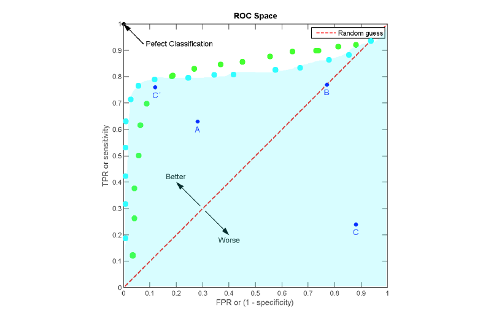

% CS34110: Computer Vision (Exam Notes)
% Charles Newey

# Paradigms in Computer Vision

## Biological Vision

* Physiologically important in the human brain
    * Between 30% and 60% of the human brain involved in visual processing
    * Perceptual illusions and diseased/damaged brains help us study how we process visual data

### Basic Eye Biology

3 layers in eye:

* Sclera (outside part that muscles attach to)
* Choroid (middle layer that contains blood vessels)
* Cornea (circular area in sclera that light enters)

Other relevant parts of the eye:

* Pupil (circular opening in choroid in centre of corna)
* Lens (sits in anterior chamber and bends light rays onto retina)
* Retina (contains nerve cells -- rods and cones)
* Fovea (central area of retina where certain cells are densely packed)
* Rods (sense brightness, evenly distributed across retina)
* Cones (sense colour, densely distributed in fovea)

#### The Two Streams Hypothesis of the Visual Pathway

A massive oversimplification, but quite useful. The theory states that there are two "streams" in
the brain (linked to various cortices):

* Ventral stream: the "what" pathway (object identification and more)
* Dorsal stream: the "where" pathway (spatial relationships, and more)

## Psychological vision

### Shortcuts

We make lots of assumptions when we "see" things, as can often be shown by optical illusions. For
example:

* Light generally comes from above
* Objects generally have convex borders
* Lines are generally continuous
* Faces are generally upright
* Many more

### Expectation

Our expectations influence what we see. "Change blindness" is a phenomena where a change in a visual
situation that subverts our expectations (for example, a moving cathedral) may go unnoticed. Note
that the change will often become more obvious after it has been noticed originally.

### Gestalt "Pop-Out" Theory

A psychotherapeutic theory of "early vision", suggesting that certain simplistic properties of
images are immediately obvious to the human brain -- for example:

* Proximity -- the human brain is good at spotting spatial clusters of features in an image
* Similarity -- the human brain is good at spotting clusters of similar features in an image, and
  therefore very good at spotting outliers quickly
* Closure -- the human brain is good at "closing" broken lines in an image, which is helpful for
  reconstructing occluded objects
* Many more

Looking at the psychological properties of images can tell us about how brains are constructed. Also
note that Gestalt-style "pop-out" may not work with multiple image properties -- which suggests that
more complex vision (object identification, etc) also involves high-level processing.

## Human Vision Summary

Human vision is inherently:

* Attentive
* Stereo (3D)
* Foveal
* Active (we move around - this helps with occlusion removal and 3D reconstruction)
* Assumptive (we take lots of visual shortcuts)

Computer vision systems are often different to human vision... and not all CV systems are the same.
With that said, studying the psychology and biology of the human visual system can still help us
understand how to optimise visual systems.

## Marr and Nishihara's Theory of Reconstructing Vision

Marr was the first person to develop a complete theory of computer vision. Marr's theory revolved
around reconstruction -- that a large part of vision involves guessing the 3D structure of the
world, and from the resultant model a high-level description (semantics) can be inferred. However,
it's unrealistic (and computationally impractical).

Five stages:

1. Image -- Get light information from everywhere in an FOV. Single frame, colour info irrelevant/
2. Raw primal sketch -- Structure in the world leads to changes in images. Locations in images of
  changes in intensity.
3. Full primal sketch -- Locations from raw primal sketch are grouped into contours and boundaries.
  This is done over several scales.
4. 2.5D sketch -- Going from images to surfaces (guessing shape). Also guessing local depth
   information (e.g., *x* in front of *y*, etc.) and surface orientation (surface normal).
5. 3D model -- A high-level 3D description of the world using generalised cylinders or cones.

## Quantitative vs. Qualitative Vision

Quantities are sensitive to noise and difficult to evaluate in a CV system. (e.g. distances to
objects, etc.). Qualities (relationships between objects) are more stable in noise and easier to
characterise. Why? All sensors are crap. It is difficult (computationally and physically) to extract
exact information... but that's not necessarily important.

### Qualitative Spatial Relations

Developed by Randall, Cui and Cohn in 1992, region connection calculus (RCC) is a qualitative way of
describing spatial relationships.

DC: Disconnected, EC: Externally connected, EQ: Equal, PO: Partially overlapping, TPP: Tangential
proper part, TPPi: Inverse of TPP, NTPP: Non-tangential proper part, NTTPi: Inverse of TPP.

# Vision Systems and Evaluation

## Processing

Stages of computer vision:

* Image processing (e.g. noise reduction, colour calibration, etc.)
* Intermediate representation (e.g. feature extraction, etc.)
* High-level vision (e.g. object detection, tracking, etc.)
* Maybe even more abstract stuff (e.g. semantics -- as in the MIT object detector and Google Images)

There are many steps in a computer vision process -- so how do we build larger systems and verify
that they work?

## Analysing Performance

How can we be sure that our algorithm works? Computer vision scientists take a data-driven approach
to testing algorithms -- separating training and test datasets, using techniques such as n-fold
cross-validation, and by using shared, open (public) datasets.

## Vision Through Learning

Modern computer vision is largely data-driven -- measuring predictions or classifications against
some measure of "ground truth". The way that most computer vision algorithms are analysed is using
large, publicly-available datasets. Some popular datasets include:

* Object recognition -- Caltech 101 (easy -- obsolete), Pascal VOC
* Segmentation -- Berkeley, Daimler
* Face recognition -- Labelled Faces in the Wild (LFW)
* Surveillance -- PETS

### Measuring Success

Useful measures include:

* True positive rate (TPR)
* False positive rate (FPR)
* Confusion matrices
* Mean squared error (distance measure over a set of points)
* Bounding box union or bounding box overlap
* ROC/AUC

#### Confusion Matrices

               Classified True Classified False
---            ---             ---
Actually True  TP              FN
Actually False FP              TN

Also note that confusion matrices can be used for multi-class classification.

#### ROC and AUC

ROC (Receiver Operating Characteristic) curves are a great way to visualise performance of a binary
classifier system because they let us see the system's performance *as a whole*, rather than just
the best part. They plot the FPR (1 - TNR, or specificity) on the *x* axis, and TPR (sensitivity) on
the *y* axis.

A few things to note on the above diagram:

* The dashed red line going diagonally across is the "chance line". If a classifier's curve lies
  mostly on the lower-right side of this line, it's actually *less likely* to predict correctly than
  a coin flip.
* The shaded blue area is the Area Under Curve (AUC). AUC is a measure sometimes used in place of
  ROC because it can be reduced to a single number and gives an objective measure of the algorithm's
  *overall* performance.

#### Bounding Box Union and Overlap

$$
Union = \frac{area(A \cap B)}{area(A \cup B)}
$$

$$
Overlap = \frac{area(A \cap B)}{min(area(A), area(B))}
$$

# Image Formation

## Geometry

### A Simple Pinhole Camera

* Uses perspective projection
* Objects are projected upside-down on the image plane
* You can't recover/calculate the distance between the camera and the object from one viewpoint

$p$ = an arbitrary point; $o$ = the origin; $f$ = focal length

### Real Cameras

Cameras are awful. They have complex control systems, limited depth of field, lens distortions
(complex optics), and various other things that cause trouble (shutter speeds, light sensitivity,
frequency response ranges, etc.).

#### Other Camera Types

* Omni-directional cameras -- either a rotating flat mirror, or a fixed hyperbolic
    * Hyperbolic mirrors distort... lots
    * Non-homogeneous resolution
    * Lots of maths to untangle the image into something same
* Parallel projection
    * Images projected the right way up (instead of upside-down)
    * Imagine a pinhole camera with an infinite focal length

## Radiosity

Brightness depends on: the amount of light hitting a surface (source intensity), the amount of light
that leaves the surface (related to absorption rate), relative positions of light source and camera,
and the orientation of the surface.

There are two different types of reflection: Lambertian and specular. On Lambertian surfaces, the
brightness only depends on the angle between the light source and the surface. Specular reflection
(e.g. a "highlight" on a reflective surface) depends on the location of the viewer.

## Digitisation

Images are not continuous -- pixels only have a limited range of values, and images have a limited
resolution. Obviously data is lost when images are captured.

### Colour Spaces

* HSV (Hue, Saturation, Value)
    * Hue represents colour (0 - 360)
    * Saturation is the quantity of colour (0 - 255)
    * Value is the dark/light scale (0 - 255)
    * Better than RGB but still not great
* CIE L\*a\*b\*
    * L: lightness, a: colour dimension, b: opponent dimension
    * A bit more complicated (based on non-linearly compressed CIE XYZ colour space)
    * But the best separation of luminance and colour

### Calibration

We need to know what the *real* colour is, to correct for colour effects of an optical device. We do
this by looking at the colour of something we definitely know. Cameras can also be calibrated for
lens distortion with "chessboard"-type images. The parallel lines and constrasting squares make it
easy to discern straight lines.

## Edges

### Detection

Images of the world are perceived as *regions* surrounded by *boundaries*. The *boundaries* are made
up of *edges* at the pixel level. However, edges aren't always evidence for boundaries -- they can
be due to lighting changes or other phenomena.

#### Edges as Intensity Changes

Differentiate the intensity profile of an image and look for very high or low values.
Differentiation of digital functions is easy_...
$$ f(x) = x_{0}, x_{1}, x_{2}, x_{3} ..., x_{n} $$
$$ \frac{df}{dx} \approx \frac{x_{2} - x_{0}}{2}, \frac{x_{3} - x_{1}}{2}, ... , \frac{x_{n - 2} - x_{n}}{2} $$

You can also achieve the same result by "dragging" a differential mask (or kernel) over an image.
For example, a $[-1, 0, 1]$ mask dragged across an image will differentiate in one direction. This
is called *convolution*.

#### The Sobel Edge Detector

The edge signal is usually noisy -- a $3x3$ kernel will have a local averaging effect. The Sobel
edge detector (developed in 1968) has this effect, and is still commonly used.

$$
\begin{bmatrix}
    -1 & 0 & 1 \\
    -2 & 0 & 2 \\
    -1 & 0 & 1 \\
\end{bmatrix}
$$

##### Tricks

Combination of *horizontal* and *vertical* edge responses:
$$ S(x) = \sqrt{S_{h}(x)^2 + S_{v}(x)^2} $$
where $S_{h}(x)$ are horizontal edges and $S_{v}(x)$ are vertical edges.

Edge direction computation:
$$ \theta(x) = tan^{-1}(S_{h}(x) / S_{v}(x)) $$
*Note*: This computation is also useful in many other algorithms that involve edge direction.

##### Problems

* Edge thickening (for example, a 1px edge will be doubled)
* Choice of threshold (at what point is a maxima an edge?)

#### Zero-Crossing

Zero-crossing edge detectors use the second derivative of the intensity gradient -- they are good
edge detectors but amplify noise badly because they square any error ($\frac{d^{2}x}{dx^{2}}$).

As with Sobel, we can combine the *horizontal* and *vertical* edge responses using the well-known
"Laplacian". Zero-crossings of the Laplacian correspond strongly to edges.

$$ \Delta^{2}\mathcal{I}(x,y) = \frac{\partial^{2}\mathcal{I}(x,y)}{dx^{2}} + \frac{\partial^{2}\mathcal{I}(x,y)}{dy^{2}} $$

#### Gaussian

Gaussians are used for lots of things in computer vision: (sort-of) noise removal, extraction of
detail at various scales, and more. Gaussian blur of *x* and *y* is given by: $$ G(x, y) =
\frac{1}{2\pi\sigma^{2}}\mathrm{e}^{-\frac{x^{2} + y^{2}}{2\sigma^{2}}} $$ where $\sigma$ is the
*standard deviation* (essentially, the *blur radius*). However, as the data are digital, the blur is
commonly implemented as a digital Gaussian kernel.

##### Application to Second-Order Edge Detection

1. Choose a small value for $\sigma$
2. Blur the image with a Gaussian
3. Filter with Laplacian -- zeroes are edges
4. Increase $\sigma$ and go again -- to locate coarser edges
5. Repeat and accumulate a "pyramid" of edge detections at different scales

This roughly describes the LoG (Laplacian of Gaussians) edge detector. This is sometimes
approximated with a DoG (Difference of Gaussians).

#### The Canny Edge Detector

Developed in 1986, probably still the most widely-used edge detector. Several parameters -- size of
Gaussian filter and two thresholding parameters -- how likely the detector is to *find* an edge, and
how likely it is to *follow* it.

Key points:

* First-order derivative
* Iterated Gaussian blur at different scales
* Directional first derivative
* Non-maximal suppression (to suppress edge thickening)
* Tracking (*hysterisis*) to link weak evidence to strong evidence

### Edge Grouping (Edges to Contours)

How to group detected edges into higher-level features (lines, circles, geometric shapes, or other
models that we may have)?

#### Line Fitting

Generally because of noise, affine transformations in the image plane, and other things, edges are
noisy and don't necessarily reflect reality -- so we have to use some kind of fitting model to group
edge pixels into higher-level features.

##### Least Squares

Least squares (regression) fitting can help us by minimizing the sum of the squared error between
our feature pixel group and our line model ($y = mx + c$), thus giving the line of best fit.

##### Hough Transform

<!-- https://www.youtube.com/watch?v=uDB2qGqnQ1g -->

Useful for detecting any parametric curves (lines, curves, ellipses, circles, etc.). Very robust,
and copes well with broken edges and noise. Given a set of edge points, the Hough transform will try
to find the line equation that best explains the data.

Given a point $(x, y)$, all lines that pass through it can be described by $y = mx + c$. We can
rewrite that so that $c = -xm + y$ -- which is a line in the parameter space of *m* and *c*. So...

Given a set of points in $(x, y)$ space, we can draw all possible lines that pass through each point
in *parameter space* -- $(m, c)$ space. The intersection of these lines in $(m, c)$ space gives us the
*best* line that describes the set of points.

The algorithm works like this:

* An "accumulator array" is initialised $(A(m, c))$ to zero
* For each edge element $(x, y)$, increment *all cells* in the accumulator array that satisfy
  $c = -xm + y$
* Local maxima (peaks) in $A(m, c)$ correspond to fitted lines

However, the Cartesian representation of lines in Hough presents a problem with *perfectly vertical
lines* -- the gradient ($m$) will tend to infinity and cause the algorithm to fail. We can get
around this by using *polar coordinates* instead of *Cartesian coordinates*.

A polar coordinate is represented as $\rho = x\sin{(\theta)} + y\sin{(\theta)}$. When a line in
Hough is transformed from Cartesian to polar coordinate space, it becomes a sinusoidal curve -- but
it is important to note that the principle of intersecting lines in $(m, c)$ space defining the
best-fitting line in $(x, y)$ space remains the same.

##### RANSAC (RAndom SAmple Consensus)

RANSAC is a simple line-fitting algorithm based in probability theory. The idea is that outliers in
a dataset (e.g. noise and other stuff) pull the fitted line away from where it should be -- the
*inliers*.

The algorithm works like this (on a simple level):

* Repeat many times:
    * Fit a model to a random subset of the points (samples)
    * Build a consensus set: other points that fit the model
    * Evaluate quality of the model: size or total error of the consensus set
* Rebuild model with best "consensus set"
* Number of iterations can be estimated based on sample size, probability of outliers, error
  threshold, and other factors
